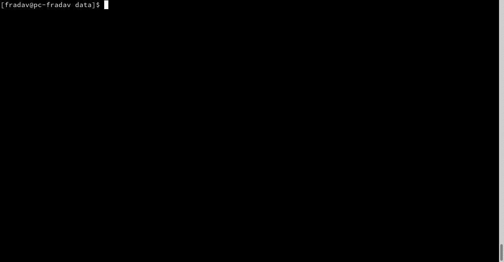
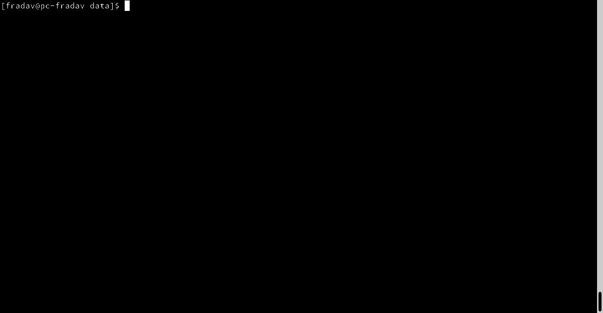

-   [Python](#python)
-   [Usage](#usage)
-   [Model Choice](#model-choice)
-   [Parameter Estimation](#parameter-estimation)
-   [TODO](#todo)
-   [References](#references)

<!-- pandoc -f markdown README-ORIG.md -t gfm -o README.md --bibliography=ref.bib -s --toc --toc-depth=1 -->
<!-- pandoc --atx-headers -f markdown README-ORIG.md -t gfm -o README.md --bibliography=ref.bib -s --toc --toc-depth=1 --webtex=https://latex.codecogs.com/png.latex? -->
<!-- [](https://travis-ci.com/fradav/abcranger) -->

[](https://pypi.python.org/pypi/pyabcranger)
[](https://github.com/diyabc/abcranger/actions?query=workflow%3Aabcranger-build+branch%3Amaster)

Random forests methodologies for :

-   ABC model choice ([Pudlo et al. 2015](#ref-pudlo2015reliable))
-   ABC Bayesian parameter inference ([Raynal et al.
    2018](#ref-raynal2016abc))

Libraries we use :

-   [Ranger](https://github.com/imbs-hl/ranger) ([Wright and Ziegler
    2015](#ref-wright2015ranger)) : we use our own fork and have tuned
    forests to do “online”[1] computations (Growing trees AND making
    predictions in the same pass, which removes the need of in-memory
    storage of the whole forest)[2].
-   [Eigen3](http://eigen.tuxfamily.org) ([Guennebaud, Jacob, and others
    2010](#ref-eigenweb))

As a mention, we use our own implementation of LDA and PLS from
([Friedman, Hastie, and Tibshirani 2001, 1:81,
114](#ref-friedman2001elements)).

There is one set of binaries, which contains a Macos/Linux/Windows (x64
only) binary for each platform. There are available within the
“[Releases](https://github.com/fradav/abcranger/releases)” tab, under
“Assets” section (unfold it to see the list).

This is pure command line binary, and they are no prerequisites or
library dependencies in order to run it. Just download them and launch
them from your terminal software of choice. The usual caveats with
command line executable apply there : if you’re not proficient with the
command line interface of your platform, please learn some basics or ask
someone who might help you in those matters.

The standalone is part of a specialized Population Genetics graphical
interface [DIYABC-RF](https://diyabc.github.io/), with a (currently
under review) submission to MER (Molecular Ecology Resources),
([Francois David Collin et al. 2020](#ref-Collin_2020)).

# Python

## Installation

``` bash
pip install pyabcranger
```

## Notebooks examples

-   On a [toy example with
    ")](https://github.com/diyabc/abcranger/blob/master/notebooks/Toy%20example%20MA(q).ipynb)
-   [Population genetics
    demo](https://github.com/diyabc/abcranger/blob/master/notebooks/Population%20genetics%20Demo.ipynb),
    data from ([Francois David Collin et al. 2020](#ref-Collin_2020)),
    available
    [there](https://github.com/diyabc/diyabc/tree/master/diyabc-tests/MER/modelchoice/IndSeq)

# Usage

``` text
 - ABC Random Forest - Model choice or parameter estimation command line options
Usage:
  ../build/abcranger [OPTION...]

  -h, --header arg        Header file (default: headerRF.txt)
  -r, --reftable arg      Reftable file (default: reftableRF.bin)
  -b, --statobs arg       Statobs file (default: statobsRF.txt)
  -o, --output arg        Prefix output (modelchoice_out or estimparam_out by
                          default)
  -n, --nref arg          Number of samples, 0 means all (default: 0)
  -m, --minnodesize arg   Minimal node size. 0 means 1 for classification or
                          5 for regression (default: 0)
  -t, --ntree arg         Number of trees (default: 500)
  -j, --threads arg       Number of threads, 0 means all (default: 0)
  -s, --seed arg          Seed, generated by default (default: 0)
  -c, --noisecolumns arg  Number of noise columns (default: 5)
      --nolinear          Disable LDA for model choice or PLS for parameter
                          estimation
      --plsmaxvar arg     Percentage of maximum explained Y-variance for
                          retaining pls axis (default: 0.9)
      --chosenscen arg    Chosen scenario (mandatory for parameter
                          estimation)
      --noob arg          number of oob testing samples (mandatory for
                          parameter estimation)
      --parameter arg     name of the parameter of interest (mandatory for
                          parameter estimation)
  -g, --groups arg        Groups of models
      --help              Print help
```

-   If you provide `--chosenscen`, `--parameter` and `--noob`, parameter
    estimation mode is selected.
-   Otherwise by default it’s model choice mode.
-   Linear additions are LDA for model choice and PLS for parameter
    estimation, “–nolinear” options disables them in both case.

# Model Choice



## Example

Example :

`abcranger -t 10000 -j 8`

Header, reftable and statobs files should be in the current directory.

## Groups

With the option `-g` (or `--groups`), you may “group” your models in
several groups splitted . For example if you have six models, labeled
from 1 to 6 \`-g “1,2,3;4,5,6”

## Generated files

Four files are created :

-   `modelchoice_out.ooberror` : OOB Error rate vs number of trees (line
    number is the number of trees)
-   `modelchoice_out.importance` : variables importance (sorted)
-   `modelchoice_out.predictions` : votes, prediction and posterior
    error rate
-   `modelchoice_out.confusion` : OOB Confusion matrix of the classifier

# Parameter Estimation



## Composite parameters

When specifying the parameter (option `--parameter`), one may specify
simple composite parameters as division, addition or multiplication of
two existing parameters. like `t/N` or `T1+T2`.

## A note about PLS heuristic

The `--plsmaxvar` option (defaulting at 0.90) fixes the number of
selected pls axes so that we get at least the specified percentage of
maximum explained variance of the output. The explained variance of the
output of the  first
axes is defined by the R-squared of the output:

^2}}{\sum_{i=1}^{N}{(y_{i}-\hat{y})^2}}")

where

is the output  scored by
the pls for the th
component. So, only the

first axis are kept, and :


Note that if you specify 0 as `--plsmaxvar`, an “elbow” heuristic is
activiated where the following condition is tested for every computed
axis :

\left(Yvar^{k+1}-Yvar^ {k}\right)")

If this condition is true for a windows of previous axes, sized to 10%
of the total possible axis, then we stop the PLS axis computation.

In practice, we find this

close enough to the previous

for 99%, but it isn’t guaranteed.

## The signification of the `noob` parameter

The median global/local statistics and confidence intervals (global)
measures for parameter estimation need a number of OOB samples
(`--noob`) to be reliable (typlially 30% of the size of the dataset is
sufficient). Be aware than computing the whole set (i.e. assigning
`--noob` the same than for `--nref`) for weights predictions ([Raynal et
al. 2018](#ref-raynal2016abc)) could be very costly, memory and
cpu-wise, if your dataset is large in number of samples, so it could be
adviseable to compute them for only choose a subset of size `noob`.

## Example (parameter estimation)

Example (working with the dataset in `test/data`) :

`abcranger -t 1000 -j 8 --parameter ra --chosenscen 1 --noob 50`

Header, reftable and statobs files should be in the current directory.

## Generated files (parameter estimation)

Five files (or seven if pls activated) are created :

-   `estimparam_out.ooberror` : OOB MSE rate vs number of trees (line
    number is the number of trees)
-   `estimparam_out.importance` : variables importance (sorted)
-   `estimparam_out.predictions` : expectation, variance and 0.05, 0.5,
    0.95 quantile for prediction
-   `estimparam_out.predweights` : csv of the value/weights pairs of the
    prediction (for density plot)
-   `estimparam_out.oobstats` : various statistics on oob (MSE, NMSE,
    NMAE etc.)

if pls enabled :

-   `estimparam_out.plsvar` : variance explained by number of components
-   `estimparam_out.plsweights` : variable weight in the first component
    (sorted by absolute value)

# TODO

## Input/Output

-   [x] Integrate hdf5 (or exdir? msgpack?) routines to save/load
    reftables/observed stats with associated metadata
-   [ ] Provide R code to save/load the data
-   [x] Provide Python code to save/load the data

## C++ standalone

-   [x] Merge the two methodologies in a single executable with the
    (almost) the same options
-   [ ] (Optional) Possibly move to another options parser (CLI?)

## External interfaces

-   [ ] R package
-   [x] Python package

## Documentation

-   [ ] Code documentation
-   [ ] Document the build

## Continuous integration

-   [x] Fix travis build. Currently the vcpkg download of eigen3 head is
    broken.
-   [ ] osX travis build
-   [ ] Appveyor win32 build

## Long/Mid term TODO

-   methodologies parameters auto-tuning
    -   auto-discovering the optimal number of trees by monitoring OOB
        error
    -   auto-limiting number of threads by available memory
-   Streamline the two methodologies (model choice and then parameters
    estimation)
-   Write our own tree/rf implementation with better storage efficiency
    than ranger
-   Make functional tests for the two methodologies
-   Possible to use mondrian forests for online batches ? See
    ([Lakshminarayanan, Roy, and Teh
    2014](#ref-lakshminarayanan2014mondrian))

# References

This have been the subject of a proceedings in [JOBIM
2020](https://jobim2020.sciencesconf.org/),
[PDF](https://hal.archives-ouvertes.fr/hal-02910067v2) and
[video](https://relaiswebcasting.mediasite.com/mediasite/Play/8ddb4e40fc88422481f1494cf6af2bb71d?catalog=e534823f0c954836bf85bfa80af2290921)
(in french), ([François-David Collin et al.
2020](#ref-collin:hal-02910067)).

<div id="refs" class="references csl-bib-body hanging-indent">

<div id="ref-Collin_2020" class="csl-entry">

Collin, Francois David, Ghislain Durif, Louis Raynal, Eric Lombaert,
Mathieu Gautier, Renaud Vitalis, Jean Michel Marin, and Arnaud Estoup.
2020. “Extending Approximate Bayesian Computation with Supervised
Machine Learning to Infer Demographic History from Genetic Polymorphisms
Using DIYABC Random Forest,” July.
<https://doi.org/10.22541/au.159480722.26357192>.

</div>

<div id="ref-collin:hal-02910067" class="csl-entry">

Collin, François-David, Arnaud Estoup, Jean-Michel Marin, and Louis
Raynal. 2020. “<span class="nocase">Bringing ABC inference to the
machine learning realm : AbcRanger, an optimized random forests library
for ABC</span>.” In *JOBIM 2020*, 2020:66. JOBIM. Montpellier, France.
<https://hal.archives-ouvertes.fr/hal-02910067>.

</div>

<div id="ref-friedman2001elements" class="csl-entry">

Friedman, Jerome, Trevor Hastie, and Robert Tibshirani. 2001. *The
Elements of Statistical Learning*. Vol. 1. 10. Springer series in
statistics New York, NY, USA:

</div>

<div id="ref-eigenweb" class="csl-entry">

Guennebaud, Gaël, Benoît Jacob, and others. 2010. “Eigen V3.”
http://eigen.tuxfamily.org.

</div>

<div id="ref-lakshminarayanan2014mondrian" class="csl-entry">

Lakshminarayanan, Balaji, Daniel M Roy, and Yee Whye Teh. 2014.
“Mondrian Forests: Efficient Online Random Forests.” In *Advances in
Neural Information Processing Systems*, 3140–48.

</div>

<div id="ref-pudlo2015reliable" class="csl-entry">

Pudlo, Pierre, Jean-Michel Marin, Arnaud Estoup, Jean-Marie Cornuet,
Mathieu Gautier, and Christian P Robert. 2015. “Reliable ABC Model
Choice via Random Forests.” *Bioinformatics* 32 (6): 859–66.

</div>

<div id="ref-raynal2016abc" class="csl-entry">

Raynal, Louis, Jean-Michel Marin, Pierre Pudlo, Mathieu Ribatet,
Christian P Robert, and Arnaud Estoup. 2018. “<span class="nocase">ABC
random forests for Bayesian parameter inference</span>.”
*Bioinformatics* 35 (10): 1720–28.
<https://doi.org/10.1093/bioinformatics/bty867>.

</div>

<div id="ref-wright2015ranger" class="csl-entry">

Wright, Marvin N, and Andreas Ziegler. 2015. “Ranger: A Fast
Implementation of Random Forests for High Dimensional Data in c++ and
r.” *arXiv Preprint arXiv:1508.04409*.

</div>

</div>

[1] The term “online” there and in the code has not the usual meaning it
has, as coined in “online machine learning.” We still need the entire
training data set at once. Our implementation is an “online” one not by
the sequential order of the input data, but by the sequential order of
computation of the trees in random forests, sequentially computed and
then discarded.

[2] We only use the C++ Core of ranger, which is under [MIT
License](https://raw.githubusercontent.com/imbs-hl/ranger/master/cpp_version/COPYING),
same as ours.
