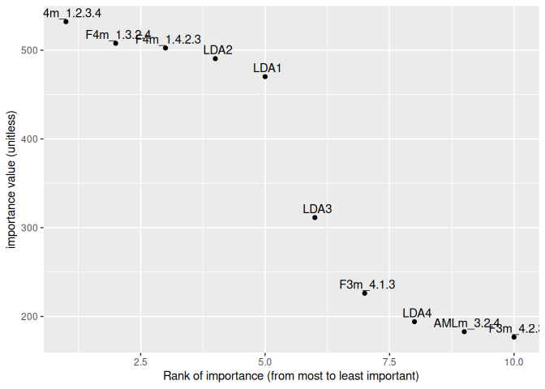
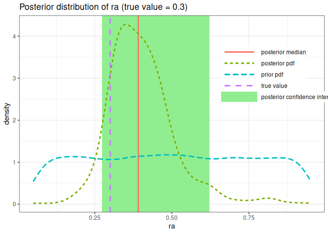

A demo of abcranger python package in R
================
François-David Collin

The following demo needs hdf5r, ggplot2, tidyverse and reticulate
packages.

<div>

> **Note**
>
> Hdf5 needs to be installed on the system. See
> [here](https://support.hdfgroup.org/HDF5/release/obtain5.html) for
> more information. If you are on a Mac, you can install it with
> [homebrew](https://brew.sh/):
>
> ``` bash
> brew install hdf5
> ```

</div>

<div>

> **Note**
>
> Hdf5 format will be the format used to store the data in the future.

</div>

If you don’t have required packages, install them:

``` r
# install.packages(c("hdf5r", "ggplot2", "tidyverse", "reticulate"))
```

Now we need to install (once) python packages in the current R session:

``` r
library(reticulate)

# py_install("numpy")
# py_install("pyabcranger", pip = TRUE)
```

<div>

> **Tip**
>
> If you have custom python environment (conda or virtualenv), you may
> need to specify it, see [official reticulate
> documentation](https://rstudio.github.io/reticulate/articles/python_packages.html).

</div>

Now we can import the python packages:

``` r
abcranger <- import("pyabcranger")
np <- import("numpy", convert = FALSE)
```

## Model choice

Let’s import a genpop reftable:

``` r
library(hdf5r)

f <- H5File$new("modelchoice-reftable.h5", mode = "r+")
```

Summary statistics and parameters need to be stored in numpy arrays:

``` r
# summary statistics
stats <- np$array(f[["stats"]][, ])
# parameters
params <- np$array(f[["params"]][, ])
```

Let’s create the abcranger object:

``` r
reftable <- abcranger$reftable(
    f[["nrec"]][1], # number of records
    f[["nrecscen"]][], # number of records per scenario
    f[["nparam"]][], # number of parameters
    h5attr(f[["params"]], "params_names"), # parameter names
    h5attr(f[["stats"]], "stats_names"), # summary statistics names
    stats, # summary statistics
    params, # parameters
    f[["scenarios"]][] # scenarios
)
```

We need observed summary statistics:

``` r
statobs <- read.table("modelchoice-statobs.txt", header = TRUE)
```

We can launch the RF analysis:

``` r
ntree <- 500

postres <- abcranger$modelchoice(reftable,
    as.single(statobs), paste("--ntree", ntree), FALSE)
```

How to extract the results:

``` r
print(paste("Predicted model  :", postres$predicted_model + 1))
```

    [1] "Predicted model  : 3"

``` r
print(paste("votes :", postres$votes))
```

    [1] "votes : c(3, 54, 404, 5, 25, 9)"

``` r
print(paste("Posterior probability : ", postres$post_proba))
```

    [1] "Posterior probability :  0.706533333333333"

Let’s plot the confusion matrix:

``` r
library(ggplot2)
library(tidyverse)
```

    ── Attaching packages ─────────────────────────────────────── tidyverse 1.3.2 ──
    ✔ tibble  3.1.7      ✔ dplyr   1.0.10
    ✔ tidyr   1.2.1      ✔ stringr 1.4.0 
    ✔ readr   2.1.3      ✔ forcats 0.5.2 
    ✔ purrr   0.3.4      
    ── Conflicts ────────────────────────────────────────── tidyverse_conflicts() ──
    ✖ dplyr::filter()     masks stats::filter()
    ✖ purrr::flatten_df() masks hdf5r::flatten_df()
    ✖ dplyr::lag()        masks stats::lag()

``` r
cm <- do.call(rbind, postres$confusion_matrix)

cm %>%
    as.data.frame() %>%
    rownames_to_column("Prediction") %>%
    pivot_longer(-c(Prediction),
        names_to = "Reference", values_to = "counts") %>%
    mutate(samples = fct_relevel(Reference, colnames(cm))) %>%
    ggplot(aes(x = Reference, y = Prediction, fill = counts), ) +
    geom_raster() +
    scale_fill_viridis_c() +
    ggtitle("Confusion matrix")
```


The MSE OOB error rate plot, w.r.t. the number of trees:

``` r
oob <- as.data.frame(postres$ntree_oob_error)

oob %>%
    rownames_to_column("TreesNumb") %>%
    ggplot(aes(x = c(1:500), y = postres$ntree_oob_error)) +
    labs(x = "Number of trees", y = "MSE OOB error (smoothed)") +
    geom_point() +
    stat_smooth(span = 0.1)
```

    `geom_smooth()` using method = 'loess' and formula = 'y ~ x'


The importance plot:

``` r
impdf <-
    data.frame(sapply(postres$variable_importance, `[[`, 2),
        row.names = labels <- sapply(postres$variable_importance, `[[`, 1)
    )
names(impdf) <- c("imp")
impdf["rank"] <- c(1:nrow(impdf))

impdf[1:10, ] %>%
    ggplot(aes(x = rank, y = imp, label = row.names(impdf[1:10, ]))) +
    labs(x = "Rank of importance (from most to least important)",
    y = "importance value (unitless)") +
    geom_point() +
    geom_text(vjust = -0.5, nudge_x = 0.05)
```



## Parameter estimation

Let’s import a genpop reftable:

``` r
f <- H5File$new("estimparam-reftable.h5", mode = "r+")

stats <- np$array(f[["stats"]][, ])
params <- np$array(f[["params"]][, ])

reftable <- abcranger$reftable(
    f[["nrec"]][1],
    list(f[["nrecscen"]][]),
    list(f[["nparam"]][]),
    h5attr(f[["params"]], "params_names"),
    h5attr(f[["stats"]], "stats_names"),
    stats,
    params,
    f[["scenarios"]][]
)
```

We need observed summary statistics:

``` r
statobs <- read.table("estimparam-statobs.txt", header = TRUE)
```

We can launch the RF analysis:

``` r
ntree <- 500

postres <- abcranger$estimparam(reftable, as.single(statobs),
    "--ntree 500 --parameter ra --noob 2000 --chosenscen 1", FALSE, FALSE)
```

How to extract the results:

``` r
ra <- sapply(postres$values_weights, `[[`, 1)
weights <- sapply(postres$values_weights, `[[`, 2)

ra_reality <- 0.3
quantile05 <- postres$point_estimates[[1]]$Quantile_0.05
quantile95 <- postres$point_estimates[[1]]$Quantile_0.95
quantile50 <- postres$point_estimates[[1]]$Median
dfw <- data.frame(ra, weights)

plotlabels <- c("true value",
    "posterior median",
    "posterior pdf",
    "prior pdf",
    "posterior confidence interval")

ggplot(dfw, aes(x = ra)) +
    geom_rect(
        aes(
            ymin = -Inf,
            ymax = Inf,
            xmin = quantile05,
            xmax = quantile95, fill = plotlabels[5]
        ),
    ) +
    geom_vline(aes(xintercept = ra_reality,
                    color = plotlabels[1],
                    linetype = plotlabels[1]),
                show.legend = FALSE, size = 1.0) +
    geom_vline(aes(xintercept = quantile50,
                    color = plotlabels[2],
                    linetype = plotlabels[2]), 
                show.legend = FALSE, size = 1.0) +
    stat_density(aes(weight = weights,
                    color = plotlabels[3],
                    linetype = plotlabels[3]),
                geom = "line", position = "identity", size = 1.0) +
    stat_density(aes(
                    color = plotlabels[4],
                    linetype = plotlabels[4]),
                geom = "line", position = "identity", size = 1.0) +
    theme_bw() +
    scale_fill_manual("Interval", values = c("lightgreen")) +
    scale_colour_discrete(name = "Legend") +
    scale_linetype_discrete(name = "Legend") +
    theme(
        legend.title = element_blank(),
        legend.position = c(0.85, 0.70),
        legend.key.width = unit(2, "cm"),
        legend.spacing.y = unit(0, "pt"),
        legend.margin = margin(0, 0, 0, 0),
    ) +
    ggtitle("Posterior distribution of ra (true value = 0.3)")
```

    Warning: Using `size` aesthetic for lines was deprecated in ggplot2 3.4.0.
    ℹ Please use `linewidth` instead.


